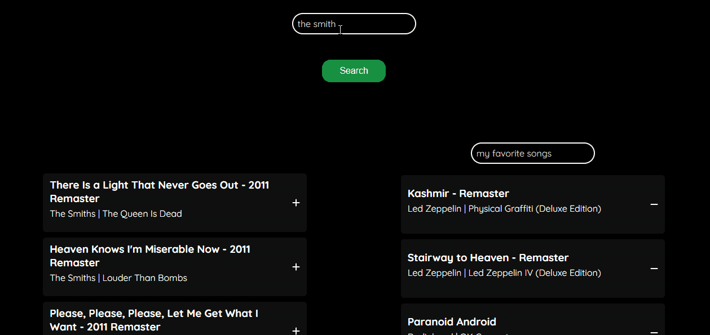

## Overview

Jamming is a dynamic web application that allows users to seamlessly create, customize, and manage Spotify playlists. Utilizing the Spotify API, this app offers an intuitive interface for searching tracks, albums, and artists, and includes features for personalized playlist management.

## Features

- **Search Functionality**: Users can search for tracks, albums, and artists using the Spotify API, providing a wide range of music to choose from.
- **Playlist Creation**: Enables users to create a personalized playlist by adding tracks to their selection.
- **Spotify Integration**: Playlists can be saved directly to the user's Spotify account with a custom name for easy access and management.

## Technologies Used

- **React**: A JavaScript library for building user interfaces.
- **Custom CSS**: For styling the application.
- **Spotify API**: To search for music and manage playlists.